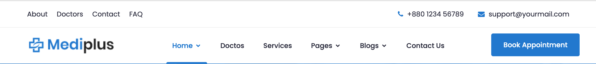
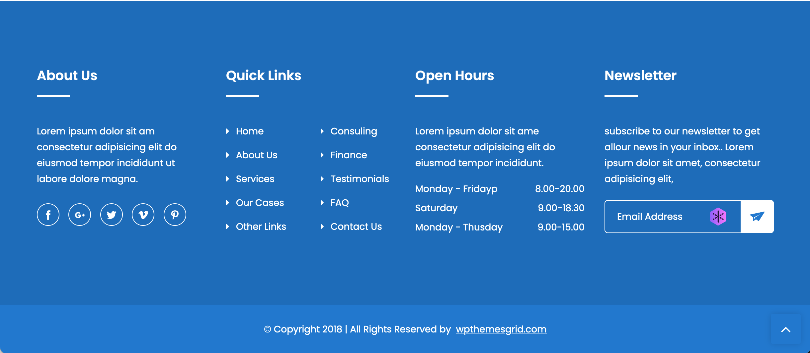

# Mediplus
## Travail à faire
### 1-Analyse et observation
`Analyser le site entier. Observer la structure de chaque section. Regarder le code source. Visiter chaque lien...`

### 2-Renommer
`Renommer tous les fichiers HTML en PHP`

### 3-Séparation
`Toutes les sections communes aux pages devront être mise dans un fichier différent à savoir "le header", "le breadcrumbs", "le footer"`

> header

> breadcrumbs

> footer

### 4- Controller
`Créer un controller pour permettre l'affichage d'une page en fonction du controller`
> Ex : indexController.php affiche la page index.php